# ELAB Automa — Schema Architetturale

> Generato: 2026-03-25 | Orchestrator V2 | 13 step per ciclo

---

## Diagramma Completo

```mermaid
flowchart TD
    %% ══════════════════════════════════════
    %% ENTRY POINT
    %% ══════════════════════════════════════
    START(["`**start.sh**
    caffeinate + nohup`"]) --> ORCH
    WATCHDOG(["`**watchdog.sh**
    launchd ogni 10min
    heartbeat check`"]) -.->|riavvia se stale| ORCH

    ORCH["`**orchestrator.py**
    run_cycle\(\)`"]

    %% ══════════════════════════════════════
    %% CICLO PRINCIPALE — 13 STEP
    %% ══════════════════════════════════════

    ORCH --> S0A

    subgraph CYCLE["🔄 CICLO PRINCIPALE (run_cycle)"]
        direction TB

        S0A["`**Step 0a**
        _snapshot_before_work\(\)
        git hash + score attuale`"]

        S0B["`**Step 0b**
        run_parallel_research\(\)
        Kimi K2.5 in background async`"]

        S0C["`**Step 0c** ogni 3 cicli
        _requeue_fixable_failed\(\)
        _research_to_tasks\(\)`"]

        S1["`**Step 1**
        run_all_checks\(\)
        7 check paralleli`"]

        S2["`**Step 2**
        get_next_task\(\)
        select_mode\(\)
        IMPROVE / AUDIT / RESEARCH / EVOLVE`"]

        S2C["`**Step 2c**
        ai_scoring\(\)
        DeepSeek + Gemini + Kimi
        valutazione qualità`"]

        S3["`**Step 3**
        compose_prompt\(\)
        run_agent\(\) via SDK
        o claude -p fallback`"]

        S3B["`**Step 3b** — Karpathy Pattern
        _keep_or_discard\(\)
        confronta score prima/dopo
        git revert se peggiora`"]

        S3C["`**Step 3c** ogni 5 cicli
        evaluate.py
        SCORE:composite=...`"]

        S4["`**Step 4**
        micro_research\(\)
        Semantic Scholar + Brain`"]

        S4B["`**Step 4b** ogni 5 cicli
        run_self_exam\(\)
        analisi pattern + proposte`"]

        S5["`**Step 5**
        save_report\(\)
        reports/cycle-NNN.json`"]

        S6["`**Step 6**
        save_state\(\)
        write_heartbeat\(\)`"]

        S0A --> S0B --> S0C --> S1 --> S2 --> S2C --> S3 --> S3B --> S3C --> S4 --> S4B --> S5 --> S6
        S6 -->|loop --loop| S0A
    end

    %% ══════════════════════════════════════
    %% MODULI PYTHON
    %% ══════════════════════════════════════

    subgraph MODULES["📦 Moduli Python"]
        direction LR

        CHECKS["`**checks.py**
        check_health\(\)
        check_build\(\)
        check_galileo\(\)
        check_content\(\)
        check_gulpease\(\)
        check_browser\(\) Playwright
        check_ipad\(\) mobile`"]

        QUEUE["`**queue_manager.py**
        queue/pending/*.yaml
        queue/active/*.yaml
        queue/done/ • queue/failed/
        get_next_task\(\)
        claim_task\(\)
        complete_task\(\)
        fail_task\(\)`"]

        TOOLS["`**tools.py**
        call_deepseek_reasoner\(\)
        call_gemini\(\)
        call_kimi\(\)
        call_kimi_vision\(\)
        call_brain\(\)
        chat_galileo\(\)
        search_papers\(\)
        gulpease_index\(\)`"]

        RESOURCE_ORCH["`**resource_orchestrator.py**
        plan_cycle_resources\(\)
        take_screenshots\(\)
        run_lighthouse\(\)
        _analyze_screenshots_with_kimi\(\)
        _run_deepseek_root_cause\(\)
        _run_gemini_strategic_summary\(\)
        gather_and_inject\(\)`"]

        SELF_EXAM["`**self_exam.py**
        load_recent_reports\(\)
        detect_patterns\(\)
        generate_proposals\(\)
        apply_low_risk_proposals\(\)
        _append_learned_rule\(\)
        update_proposal_confidence\(\)`"]

        PARALLEL_RES["`**parallel_research.py**
        run_parallel_research\(\)
        get_latest_findings\(\)
        get_actionable_findings\(\)
        → state/parallel-research.json`"]

        AGENT["`**agent.py**
        run_agent\(\) SDK Anthropic
        execute_tool\(\)
        max_turns: 20
        model: claude-sonnet-4`"]

        CONTEXT_DB["`**context_db.py**
        SQLite context.db
        add_knowledge\(\)
        add_score\(\)
        search_knowledge\(\)
        get_context_summary\(\)`"]

        EVALUATE["`**evaluate.py**
        SCORE:composite=...
        metriche composte`"]

        MICRO["`**micro_research.py**
        ricerca rapida
        Semantic Scholar API`"]

        BENCH["`**benchmarks.py**
        misure performance`"]

        VOCAB["`**vocab_checker.py**
        check Gulpease
        leggibilità testi`"]

        ENHANCED["`**enhanced_research.py**
        ricerca approfondita
        multi-source`"]

        PROMPT_T["`**prompt_templates.py**
        template strutturati
        per modalità`"]
    end

    %% ══════════════════════════════════════
    %% AGENTI SPECIALIZZATI
    %% ══════════════════════════════════════

    subgraph AGENTS_DIR["🤖 agents/"]
        direction LR
        GALILEO_JUDGE["`galileo-judge.py
        valuta risposte AI`"]
        GALILEO_TESTER["`galileo-tester.py
        test automatici`"]
        USER_SIM["`user-sim.py
        simula Marco 8y
        Sofia 11y, Prof Rossi`"]
        PEDAGOGY["`pedagogy-sim.py
        simulazione pedagogica`"]
        SYNTH["`synthesizer.py
        sintetizza risultati`"]
        QUICK_TEST["`quick-test.py
        10 messaggi nanobot
        loop.sh entry`"]
    end

    %% ══════════════════════════════════════
    %% 4 LLM + BRAIN
    %% ══════════════════════════════════════

    subgraph LLMS["🧠 LLM & AI"]
        direction TB

        CLAUDE["`**Claude Sonnet 4**
        Agent principale
        Agent SDK / claude -p
        Esegue task, scrive codice
        20 tool turns / ciclo`"]

        DEEPSEEK["`**DeepSeek R1**
        Root-cause analysis
        AI scoring qualità
        Ogni ciclo`"]

        GEMINI["`**Gemini 2.5 Pro**
        Strategic summary
        Market analysis
        Vision screenshots
        ogni 3 cicli`"]

        GEMINI_CLI["`**Gemini CLI** (subprocess)
        npx @google/gemini-cli
        Agente parallelo a Claude
        RESEARCH / INNOVATE`"]

        KIMI["`**Kimi K2.5**
        Parallel research async
        Vision analysis
        Code review
        ogni ciclo background`"]

        BRAIN["`**Brain VPS** 🖥
        72.60.129.50:11434
        galileo-brain-v13
        Qwen3.5-2B Q5_K_M
        Ollama locale`"]
    end

    %% ══════════════════════════════════════
    %% FILE DI STATO E MEMORIA
    %% ══════════════════════════════════════

    subgraph STATE_FILES["💾 Stato & Memoria"]
        direction TB

        STATE_JSON["`**state/state.json**
        loop stats, cycle count
        last_elapsed, scores`"]

        HEARTBEAT["`**state/heartbeat**
        timestamp ultimo ciclo
        watchdog check`"]

        PARALLEL_JSON["`**state/parallel-research.json**
        findings Kimi async`"]

        CYCLES_HIST["`**state/cycles-history.md**
        storico tutti i cicli`"]

        METRIC_HIST["`**state/metric-history.json**
        trend metriche nel tempo`"]

        SNAPSHOT_JSON["`**state/cycle-snapshot.json**
        git hash + score prima
        del work (keep/discard)`"]

        LAST_EVAL["`**state/last-eval.json**
        ultimo composite score
        da evaluate.py`"]

        LIGHTHOUSE["`**state/lighthouse-latest.json**
        Performance/SEO/A11y`"]

        AI_FEEDBACK["`**state/ai-feedback.log**
        feedback persistito
        DeepSeek/Gemini/Kimi`"]

        LEARNED_RULES["`**learned_rules.md**
        regole auto-apprese
        da self_exam`"]

        SELF_EXAM_LOG["`**self_exam_log.json**
        proposte, confidence
        stato auto-improvement`"]

        CONTEXT_SQLITE["`**state/context.db**
        SQLite: knowledge
        scores, experiments
        articles history`"]

        RESULTS_TSV["`**results.tsv**
        git_hash | score | mode
        verdict keep/discard`"]
    end

    %% ══════════════════════════════════════
    %% SERVIZI ESTERNI
    %% ══════════════════════════════════════

    subgraph EXTERNAL["🌐 Servizi Esterni"]
        direction LR

        VERCEL["`**Vercel**
        elabtutor.school
        deploy prod
        npm run build +
        vercel --prod`"]

        RENDER["`**Render**
        elab-galileo.onrender.com
        Nanobot REST API
        /health /chat /ask`"]

        NOTION["`**Notion**
        curriculum, articoli
        knowledge base
        MCP integration`"]

        SEMANTIC["`**Semantic Scholar**
        search_papers\(\)
        ricerca accademica
        EdTech papers`"]

        PLAYWRIGHT_SVC["`**Playwright**
        browser headless
        screenshot /
        check_browser\(\)
        check_ipad\(\)`"]
    end

    %% ══════════════════════════════════════
    %% SKILL DISPATCH
    %% ══════════════════════════════════════

    subgraph SKILLS["🎯 Skill Dispatch"]
        direction LR

        SK_RESEARCH["`**RESEARCH mode**
        ricerca-tecnica
        ricerca-innovazione
        ricerca-marketing
        ricerca-idee-geniali
        ricerca-contesto`"]

        SK_AUDIT["`**AUDIT mode**
        ricerca-bug
        analisi-simulatore
        analisi-galileo
        lim-simulator
        impersonatore-utente`"]

        SK_EVOLVE["`**EVOLVE mode**
        analisi-statistica-severa
        ricerca-sviluppo-autonomo
        giudizio-multi-ai
        analisi-video-kimi`"]
    end

    %% ══════════════════════════════════════
    %% CONNESSIONI PRINCIPALI
    %% ══════════════════════════════════════

    %% Orchestrator → Moduli
    S1 --> CHECKS
    S2 --> QUEUE
    S2C --> RESOURCE_ORCH
    S3 --> AGENT
    S3B --> SNAPSHOT_JSON
    S4 --> MICRO
    S4B --> SELF_EXAM
    S5 --> CYCLES_HIST
    S6 --> STATE_JSON
    S6 --> HEARTBEAT
    S0B --> PARALLEL_RES

    %% Tools → LLM
    TOOLS --> DEEPSEEK
    TOOLS --> GEMINI
    TOOLS --> KIMI
    TOOLS --> BRAIN
    RESOURCE_ORCH --> GEMINI_CLI

    %% Agent → Claude
    AGENT --> CLAUDE

    %% Self-exam → Rules
    SELF_EXAM --> LEARNED_RULES
    SELF_EXAM --> SELF_EXAM_LOG

    %% Context DB
    CONTEXT_DB --> CONTEXT_SQLITE
    S3 --> CONTEXT_DB

    %% Checks → External
    CHECKS --> RENDER
    CHECKS --> VERCEL
    CHECKS --> PLAYWRIGHT_SVC

    %% Resource Orchestrator → LLM
    RESOURCE_ORCH --> KIMI
    RESOURCE_ORCH --> DEEPSEEK
    RESOURCE_ORCH --> GEMINI

    %% Tools → External APIs
    TOOLS --> SEMANTIC
    TOOLS --> RENDER
    TOOLS --> VERCEL

    %% Skill dispatch → mode
    S2 --> SK_RESEARCH
    S2 --> SK_AUDIT
    S2 --> SK_EVOLVE

    %% Evaluate
    S3C --> EVALUATE
    EVALUATE --> LAST_EVAL

    %% Results TSV (keep/discard tracking)
    S3B --> RESULTS_TSV

    %% Parallel research findings
    PARALLEL_RES --> PARALLEL_JSON
    PARALLEL_RES --> KIMI

    %% Micro research
    MICRO --> SEMANTIC
    MICRO --> BRAIN

    %% Queue files
    QUEUE --> STATE_JSON

    %% Context → Prompt
    CONTEXT_DB --> S3

    %% Notion
    TOOLS -.-> NOTION
```



---

## Legenda dei 13 Step

| Step | Nome | Modulo | Frequenza |
|------|------|--------|-----------|
| 0a | Snapshot git+score | orchestrator.py | ogni ciclo |
| 0b | Parallel Kimi research | parallel_research.py | ogni ciclo (async) |
| 0c | Requeue failed + research→tasks | orchestrator.py | ogni 3 cicli |
| 1 | 7 Health checks | checks.py | ogni ciclo |
| 2 | Adaptive mode + next task | queue_manager.py | ogni ciclo |
| 2c | AI scoring (DeepSeek/Gemini/Kimi) | orchestrator.py → tools.py | condizionale (vedi freq.) |
| 3 | Compose prompt + run Claude | agent.py / claude -p | ogni ciclo |
| 3b | Keep/Discard (Karpathy) | orchestrator.py | se task done |
| 3c | evaluate.py composite score | evaluate.py | ogni 5 cicli |
| 4 | Micro-research Semantic Scholar | micro_research.py | ogni ciclo |
| 4b | Self-exam pattern analysis | self_exam.py | ogni 5 cicli |
| 5 | Save report JSON | orchestrator.py | ogni ciclo |
| 6 | Save state + heartbeat | orchestrator.py | ogni ciclo |

---

## I 4 LLM + Brain VPS

| LLM | Ruolo | Frequenza | Costo |
|-----|-------|-----------|-------|
| **Claude Sonnet 4** | Agente principale, esegue task | ogni ciclo | SDK Anthropic |
| **DeepSeek R1** | Root-cause analysis, scoring | ogni ciclo | API DeepSeek |
| **Gemini 2.5 Pro** | Strategic summary, vision, CLI agent | ogni 1-3 cicli | API Google |
| **Kimi K2.5** | Parallel research async, vision review | ogni ciclo bg | API Moonshot |
| **Brain VPS** | Galileo tutor AI (inference locale) | health check + chat | VPS €/mese |

---

## Flusso Dati Semplificato

```
start.sh → orchestrator.py → [13 step per ciclo]
                │
    ┌───────────┼───────────────────┐
    ▼           ▼                   ▼
checks.py   queue_manager.py   parallel_research.py (Kimi async)
    │           │
    ▼           ▼
[7 check]   [task.yaml]
                │
                ▼
        compose_prompt() ← context_db.py ← learned_rules.md
                │
                ▼
          agent.py (SDK) ─→ Claude Sonnet 4
                │
                ▼
        _keep_or_discard() ─→ git revert if score ↓
                │
                ▼
        ai_scoring() ─→ DeepSeek + Gemini + Kimi
                │
                ▼
        self_exam.py (ogni 5 cicli) ─→ auto-regole
                │
                ▼
        save_report() + save_state() + heartbeat
```

---

## Servizi Esterni

| Servizio | URL | Scopo |
|----------|-----|-------|
| **Vercel** | elabtutor.school | Deploy produzione frontend React + Vite |
| **Render** | elab-galileo.onrender.com | Nanobot REST API (Galileo tutor) |
| **Brain VPS** | 72.60.129.50:11434 | Ollama con galileo-brain-v13 (Qwen Q5) |
| **Semantic Scholar** | API pubblica | Ricerca paper EdTech |
| **Notion** | MCP integration | Curriculum, articoli, knowledge base |

---

## Anatomia dei Prompt

### Struttura del Prompt Principale (`compose_prompt`)

Il prompt inviato a Claude ogni ciclo ha questa struttura in **10 layer**:

```
IDENTITA
  └─ Modo: IMPROVE/RESEARCH/AUDIT/EVOLVE/WRITE | Ciclo: N

PRINCIPIO ZERO
  └─ "L'insegnante inesperto è il vero utente. LIM: 10-14 anni."
  └─ [ALERT regressione score se drop > 5%]

PROGRAMMA (program.md, max 3000 chars)
  └─ Visione, 5 modi di lavoro, regole modifica

CONTESTO PEDAGOGICO
  └─ context/teacher-principles.md
  └─ context/volume-path.md

PIANO PDR (PDR.md, max 2000 chars)
  └─ 16 aspetti prioritizzati

CONTESTO — 10 LAYER
  Layer 1: results.tsv  ← storico keep/discard con score
  Layer 2: Ultimo report JSON (600 chars)
  Layer 3: Handoff.md (600 chars)
  Layer 4: git log --oneline -10
  Layer 5: Knowledge index (ultimi 15 file)
  Layer 6: AI feedback log (ultimi 10 entry)
  Layer 7: Score composito (last-eval.json)
  Layer 8: Context DB summary (SQLite)
  Layer 9: Regole apprese (learned_rules.md) + regole esecutive
  Layer 10: Parallel findings Kimi (ultimi 5) + azioni urgenti

CHECK RESULTS
  └─ 7 check: PASS/FAIL/WARN con dettaglio

[SEZIONE WORK — dipende dal modo]

REGOLE (7 invarianti)
  1. ZERO REGRESSIONI — npm run build DEVE passare
  2. CoV obbligatoria alla fine
  3. Massima onestà — FAIL non "parzialmente ok"
  4. L'insegnante è il vero utente
  5. Touch >=56px, font leggibili
  6. Severity obbligatoria: blocker/high/medium/low
  7. Evidence level: verified/hypothesis/speculation

COV OBBLIGATORIA (8 domande)
  1. Claim senza prova?  2. Contraddizioni?
  3. Regressioni?        4. Build passa?
  5. Principio Zero?     6. Output riusabile?
  7. Severity assegnata? 8. Punti deboli?

OUTPUT JSON (ultima riga)
  {"task":"...", "status":"done|partial|failed",
   "files_changed":[], "build_pass":true,
   "cov_verified":true, "severity":"low",
   "evidence":"verified"}
```

---

### Sezione Work per Modo

| Modo | Trigger | Prompt Work Section |
|------|---------|---------------------|
| **IMPROVE** | check fail, task P0/P1, default | FIX FAILED CHECKS o task specifico + build verify |
| **RESEARCH** | ciclo % 3 == 0 | Skill dispatch + Semantic Scholar + Gemini + DeepSeek → knowledge/research-cycle-N.md |
| **AUDIT** | ciclo % 5 == 0 | Skill dispatch + Playwright + bug finding → reports/audit-cycle-N.md |
| **EVOLVE** | ciclo % 10 == 0 | Skill dispatch + metriche + auto-miglioramento sistema |
| **WRITE** | ciclo % 20 == 0 | UN articolo in articles/ → byline "Andrea Marro" |

---

### Prompt Templates Strutturati (`prompt_templates.py`)

Ogni template eredita da `WORKER_BASE`:

```
WORKER_BASE
  ├─ Identità worker specializzato (non il sistema intero)
  ├─ Principio Zero
  ├─ Stile: onestà, no claim senza prova
  └─ Severity scale: blocker/high/medium/low

IMPROVE_TEMPLATE
  ├─ Goal + Why now + Outcome misurabile
  ├─ Plan max 5 passi (leggi → modifica minima → build → test → documenta)
  └─ Output: actions, tests, evidence

RESEARCH_TEMPLATE
  ├─ Contesto prodotto (62 esperimenti, Galileo, simulatore)
  ├─ Obiettivo: identificare problemi reali non intuibili dal codice
  ├─ Focus topics: pedagogia, EdTech, misconcezioni, LIM, offline PWA
  └─ Output: topic, why relevant, fonti, 3 findings utili, 3 da scartare, tasks

AUDIT_TEMPLATE
  ├─ Checklist: build, test, console errors, touch ≥44px, font ≥14px, WCAG AA
  ├─ Ogni bug: severity + repro + expected + actual + fix
  └─ Output: bugs con severity, task YAML in queue/pending/

EVOLVE_TEMPLATE
  ├─ Domande guida: metriche troppo facili?, skill inutilizzate?, score oscilla?
  ├─ Focus: migliorare il sistema di automiglioramento stesso
  └─ Output: metriche analizzate, proposte con effort estimate

COV_TEMPLATE (aggiunto alla fine di ogni prompt)
  └─ 8 domande — non ammorbidire le conclusioni
```

---

### Prompt AI Scoring (`ai_scoring`)

| LLM | Frequenza | Prompt |
|-----|-----------|--------|
| **DeepSeek R1** | ogni 5 cicli | Valuta risposta Galileo su "LED + breadboard" (1-10): chiarezza, età, correttezza, incoraggiamento → SCORE:N MOTIVO:breve |
| **Gemini 2.5** | ogni 10 cicli | Analizza mercato EdTech italiano 2026: competitor ELAB, cosa manca (200 parole) |
| **Kimi K2.5** | ogni 10 cicli (offset 5) | Review EdTech: 62 esperimenti + score attuale → cosa miglioreresti (200 parole) |

---

### Prompt Micro-Research (`micro_research`)

16 topic a rotazione (`cycle % 16`):

```
educational electronics simulation children
Scratch to Arduino C++ block programming
AI tutoring scaffolding real-time
circuit simulation browser WebAssembly
readability index Italian children
iPad touch interface educational
offline progressive web app education
Socratic questioning AI tutor
inexperienced teacher technology adoption barriers
maker education elementary school
gamification STEM learning engagement
EdTech product marketing school adoption
misconceptions electricity children
visual programming Arduino pedagogy
LIM interactive whiteboard classroom electronics
progressive web app offline education developing countries
```

Per ogni topic: Semantic Scholar (5 paper) + Kimi (3 trend, 1 idea, 1 rischio) + DeepSeek (2 problemi, 1 soluzione, 1 metrica).

---

### Skill Dispatch Prompt (`_skill_section_for_mode`)

Ogni ciclo seleziona la skill primaria con `idx = cycle % len(skills)`:

```
RESEARCH skills (round-robin):
  ricerca-tecnica       — soluzioni tecniche, librerie, architetture
  ricerca-innovazione   — trend EdTech, paper, brevetti
  ricerca-marketing     — competitor, target, pricing
  ricerca-idee-geniali  — idee breakthrough con pensiero laterale
  ricerca-contesto      — miglioramento contesto tra sessioni

AUDIT skills (round-robin):
  ricerca-bug           — bug hunting proattivo su edge case
  analisi-simulatore    — CircuitSolver, AVR, accuratezza, performance
  analisi-galileo       — qualità risposte AI, tono pedagogico
  lim-simulator         — usabilità su LIM scolastica
  impersonatore-utente  — simula Marco 8y, Sofia 11y, Prof Rossi

EVOLVE skills (round-robin):
  analisi-statistica-severa  — metriche, trend, significatività
  ricerca-sviluppo-autonomo  — nuove idee auto-improvement ciclo
  giudizio-multi-ai          — valutazione DeepSeek+Kimi+Gemini
  analisi-video-kimi         — review visuale con Kimi su screenshot
```
